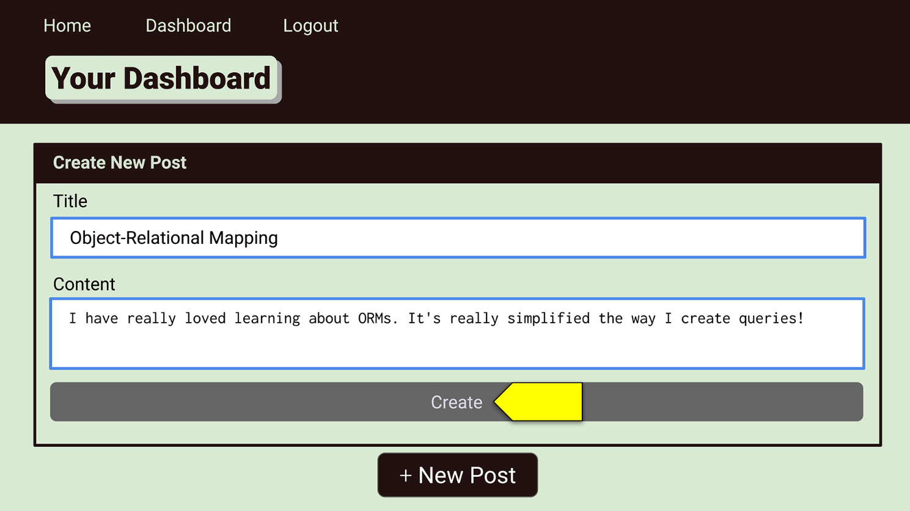

# Teachers Blog

## Description

This website was created to be a space where teachers, administrators, and other people in the education field can discuss what is happening in there schools. Users can create post and comment about those post. This will allow users to see how different schools deal with similar issues. It also allows for discussion for the best practices in the classroom. These conversations will help teachers and other educators get insight into other classroom and better their own.

## Installation

To run this application please go to the following url and interact with the website there. 

## Usage

To be able to create a post or comment the user needs to create an account with our website. Create an account by creating a username and a password. Once that information is added and the user logs in, the user is able to interact in the discussions taking place.

## License

No license

---

## Questions

If you have any follow up questions, feel free to reach out at gaylehoefer@gmail.com  
GitHub: https://www.github.com/hoeferg
